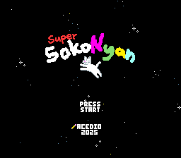

# snes-forth

A (at the moment very incomplete) Forth for the SNES!

## Credits

Font is adapted from Hourglass by [DamienG](https://damieng.com/zx-origins).
FM\_Harp.brr was authored by [Doug Fraker](https://github.com/nesdoug/SNES_13).
Terrific Audio Driver was authored by
[Marcus Rowe](https://github.com/undisbeliever/terrific-audio-driver).
